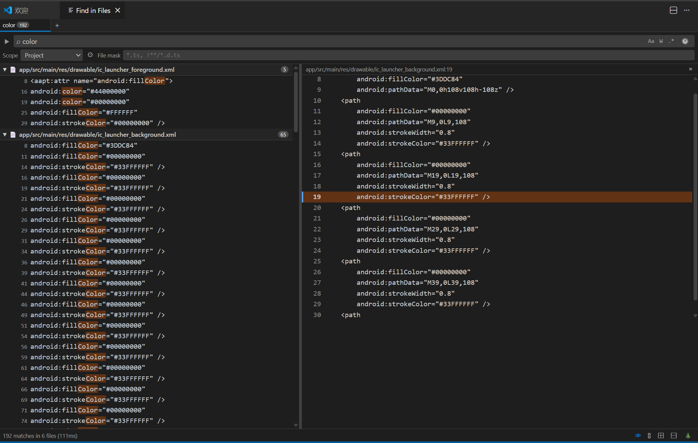
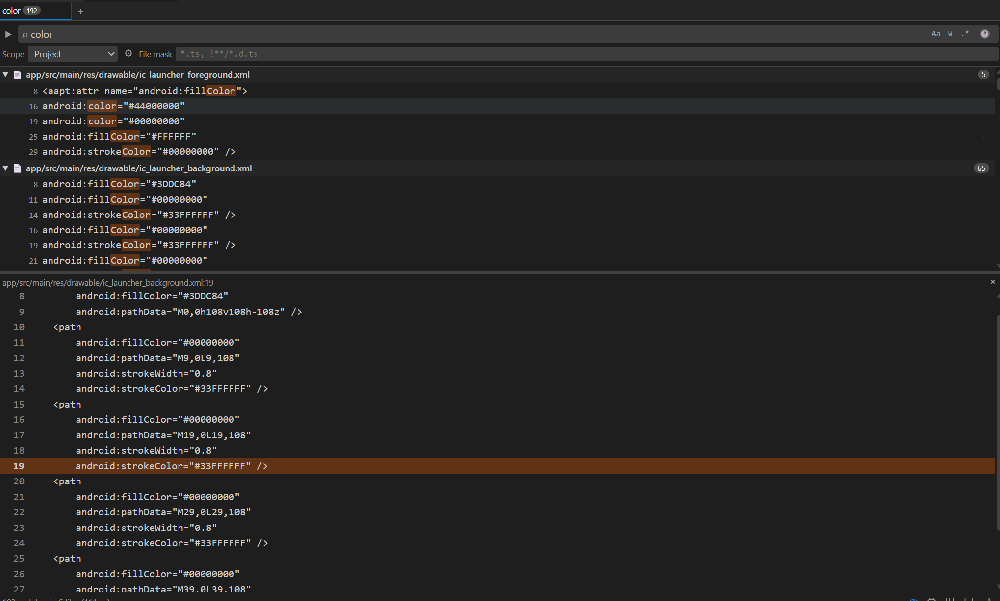
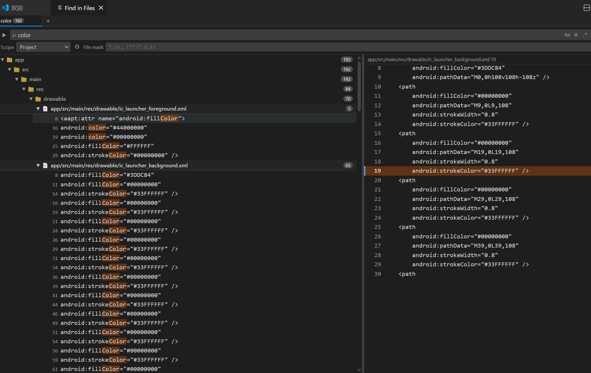

# idea-search — VSCode 插件需求文档

> 目标：在 VSCode 中复刻 IntelliJ IDEA 的全文搜索体验，弥补 VSCode 原生搜索在空间布局、多会话、Scope 灵活性上的不足。

---

## Snapshots







## 一、背景与动机

### VSCode 原生搜索的痛点

| 痛点 | 描述 |
|------|------|
| 侧边栏空间局促 | 搜索结果与文件树共用侧边栏，垂直空间不足，结果列表很短 |
| 无多会话支持 | 每次新搜索会覆盖上一次结果，无法并排对比多次搜索 |
| Scope 能力弱 | 只能通过 `include/exclude` glob 手工填写，无法定义和复用命名范围 |
| 结果组织方式固定 | 仅按文件平铺，无法按目录树层级折叠/展开 |
| 缺少统一搜索入口 | 文件搜索、符号搜索、文本搜索入口分散，没有类似 IDEA "Search Everywhere" 的聚合界面 |

### IDEA 的参考体验

- **Search Everywhere**（双击 Shift）：单一浮窗聚合搜索文件、类、符号、Action、文本
- **Find in Files**：底部独立工具窗口，不占用侧边栏；结果按目录树分组；支持多标签保留历史会话
- **Scope**：内置项目/测试/生产范围，并支持自定义命名 Scope 持久化复用

---

## 二、功能需求

### F1 — Search Everywhere（统一搜索 Tab）

**优先级：P0 ✅ 已实现**

用一个独立 Tab 聚合多类搜索结果，取代分散的快捷键入口。

> **实现说明**：VS Code WebviewPanel 本质是编辑器 Tab，无法真正覆盖在其他 UI 之上，因此改为铺满 Tab 全屏。

#### 需求点

- `F1.1` 通过快捷键（默认 `Ctrl+Alt+Shift+F`，可配置）打开 Tab
- `F1.2` 顶部为搜索输入框，实时增量搜索（200ms debounce）
- `F1.3` 结果分 Tab 展示：**All / Files / Symbols / Text / Actions**（由 LSP `executeWorkspaceSymbolProvider` 提供符号）
- `F1.4` 键盘可完全操作：↑↓ 导航，`Enter` 打开，`Tab` 切换类别
- `F1.5` 结果条目：图标 + 名称 + 所在文件路径（灰色次要文字）
- `F1.6` **右侧预览面板**：单击结果更新预览，双击打开源文件；双击预览行跳转到该行；分隔条可拖拽调宽
- `F1.7` CamelCase / 子序列模糊匹配（如 `UC` 匹配 `UserController`）

---

### F2 — Find in Files（独立搜索 Tab）

**优先级：P0 ✅ 已实现**

Find in Files 以独立 Tab 形式呈现，铺满编辑区，不占用侧边栏。

> **实现说明**：原计划的"浮窗 → Open in Tab"两阶段已简化为直接打开全屏 Tab，交互更稳定。

#### 需求点

- `F2.1` 快捷键（默认 `Ctrl+Alt+F`）打开搜索 Tab，铺满编辑区
- `F2.2` 搜索条件区包含：
  - 搜索关键词输入框
  - 替换关键词输入框（可折叠，见 F6）
  - 按钮：大小写敏感 `Aa`、全词匹配 `W`、正则 `.*`
  - Scope 选择下拉框（见 F4）
  - File Mask 输入框（见 F2.11 详细说明）
- `F2.3` 结果区支持按目录树分组展示（见 F5）
- `F2.4` **单击**结果条目 → 更新预览面板；**双击**条目 → 跳转编辑器对应行
- `F2.5` `Ctrl+双击` 在新编辑器列中打开；键盘 `Enter` 等同双击
- `F2.6` 状态栏显示：匹配行数、匹配文件数、搜索耗时
- `F2.7` 支持流式渲染结果（边搜索边展示）
- `F2.8` **预览面板**：与结果区通过拖拽分隔条调整比例，支持上下/左右两种布局（自动根据窗口宽高比选择，可手动切换）；双击预览行跳转到该行
- `F2.9` 结果每条目显示：行号、匹配文本（关键词高亮）、所在文件相对路径（前导空白已裁剪）
- `F2.11` **File Mask 过滤规则**：
  - 支持按文件**后缀名**过滤，多个后缀用英文逗号分隔，如 `*.ts, *.tsx, *.vue`
  - 支持包含 **路径的通配符**，语法与 glob 一致：
    | 示例 | 含义 |
    |------|------|
    | `*.ts` | 任意目录下的 `.ts` 文件 |
    | `.gradle*` | 名称以 `.gradle` 开头的任意文件（如 `.gradle`, `.gradle.kts`） |
    | `src/**/*.test.ts` | `src` 目录下所有层级的 `.test.ts` 文件 |
    | `**/generated/**` | 任意层级下的 `generated` 目录内所有文件 |
    | `!**/node_modules/**` | `!` 前缀表示排除规则 |
  - 多条规则之间用**逗号**分隔，include 与 exclude 可混用，如 `*.ts, !**/*.d.ts`
  - 输入框提供 datalist 语法提示，内置 TypeScript / JavaScript / Python / Java / Gradle 等预设

---

### F3 — 多标签搜索会话

**优先级：P1 ✅ 已实现**

允许同时保留多次搜索结果，切换查看而不丢失上下文。

#### 需求点

- `F3.1` Find in Files 面板顶部显示标签栏，每次搜索默认创建新标签
- `F3.2` 标签显示关键词缩略文字；鼠标悬停 Tooltip 显示完整搜索条件
- `F3.3` 可通过按钮或快捷键 `Ctrl+W` 关闭当前标签
- `F3.4` 提供"Pin 标签"功能：固定标签不被新搜索覆盖
- `F3.5` 标签数量上限可配置（默认 10），超出时淘汰最旧未固定标签
- `F3.6` 面板关闭后重新打开，已固定的标签恢复（通过 `workspaceState` 持久化）

---

### F4 — 自定义 Scope

**优先级：P1 ✅ 已实现**

支持定义、保存、复用命名搜索范围，不再每次手动填写路径。

#### 需求点

- `F4.1` 内置 Scope：
  - `Project` — 工作区所有文件（排除 `.gitignore` 和用户配置的 `excludePatterns`）
  - `Open Files` — 当前已打开的编辑器文件
  - `Current File` — 仅当前激活文件（降级为文件内搜索）
  - `Git Changed Files` — `git status` 中变更的文件（需 Git 环境）
- `F4.2` 用户可通过 UI 创建自定义 Scope，配置项：
  - 名称
  - 包含路径列表（支持 glob）
  - 排除路径列表（支持 glob）
- `F4.3` 自定义 Scope 持久化存储至工作区 `.vscode/idea-search-scopes.json`
- `F4.4` Scope 可在 Find in Files 的下拉框中直接选用
- `F4.5` 提供 Scope 管理界面（增/删/改/排序）

---

### F5 — 结果目录树分组展示

**优先级：P1 ✅ 已实现**

按目录层级折叠展示结果，便于理解结果的项目分布。

#### 需求点

- `F5.1` 提供两种视图模式（可切换）：
  - **Flat 模式**：按文件平铺（类似 VSCode 现有行为）
  - **Tree 模式**：按目录树层级分组，可折叠
- `F5.2` Tree 模式下，目录节点显示该目录下的匹配文件数和总匹配行数
- `F5.3` 支持全部展开 / 全部折叠快捷按钮
- `F5.4` 记住上次使用的视图模式（`globalState` 持久化）
- `F5.5` 每个文件节点右侧显示该文件的匹配行数徽标

---

### F6 — Replace in Files（全局替换）

**优先级：P1 ✅ 已实现**

在 Find in Files 基础上支持全局替换，需确保操作安全可撤销。

#### 需求点

- `F6.1` 点击搜索栏左侧展开箭头，显示替换输入框
- `F6.2` 支持的替换模式：
  - 普通字符串替换
  - 正则捕获组引用（如 `$1`, `$2`）
- `F6.3` 替换操作粒度：
  - **Replace All** — 替换所有匹配
  - **Replace File** — 替换选中文件中的所有匹配
  - **Replace Item** — 替换单条匹配
- `F6.4` 每个结果条目右侧显示"排除此条"按钮，排除后该条不参与替换
- `F6.5` 替换前弹出确认对话框，展示：将替换的文件数、匹配行数
- `F6.6` 替换操作通过 VSCode `WorkspaceEdit` API 执行，天然支持 `Ctrl+Z` 撤销

---

### F7 — 搜索历史

**优先级：P2 ✅ 已实现**

记录历史搜索关键词，快速复用。

#### 需求点

- `F7.1` 搜索框支持上/下方向键浏览历史关键词（焦点在输入框时）
- `F7.2` 输入框右侧提供历史下拉按钮，展示最近 20 条搜索记录
- `F7.3` 历史记录包含关键词 + 当时的 Scope + 文件 Mask，可一键还原完整搜索条件
- `F7.4` 历史持久化至 `workspaceState`，工作区隔离
- `F7.5` 提供"清除历史"按钮

---

### F8 — 预览面板

**优先级：P2 ✅ 已实现**

点击搜索结果时在旁侧预览，减少上下文切换干扰。

#### 需求点

- `F8.1` Find in Files 右侧（宽屏）或下方（窄屏）分割出预览区域，通过拖拽分隔条调整大小
- `F8.2` **单击**结果条目：预览区显示对应文件，命中行高亮并滚动到视图中心
- `F8.3` 预览区为只读；**双击**预览行跳转编辑器对应行
- `F8.4` 预览面板可通过状态栏 👁 按钮关闭/开启（默认开启）
- `F8.5` 布局方向（上下/左右）通过状态栏 ⇔/⇕ 按钮手动切换，宽屏默认左右；状态持久化

---

## 三、非功能需求

| 项目 | 要求 |
|------|------|
| **性能** | 万级文件项目下，Find in Files 首个结果出现时间 < 500ms；Search Everywhere 实时结果延迟 < 100ms |
| **可配置性** | 所有快捷键均可通过 VSCode 键绑定覆盖 |
| **主题适配** | UI 完全跟随 VSCode 当前颜色主题（使用 CSS Variables / `vscode-*` 颜色 token） |
| **无外部依赖** | 插件不依赖任何需要单独安装的运行时；搜索引擎使用 VSCode 内置 API 或 Node.js 原生能力 |
| **离线可用** | 全部功能在无网络环境下正常工作 |

---

## 四、范围外（Not In Scope）

- 跨多个工作区/远程主机的搜索（当前仅支持本地工作区）
- 代码语义搜索（如"找到所有 `UserService` 的实现"）— 此类需求由 Language Server 承担
- 内置 Diff 视图（替换预览直接复用 VSCode 原生 diff）
- 移动端 / vscode.dev Web 版适配（暂不考虑）

---

## 五、核心用户故事

```
作为开发者，
当我在大型项目中需要同时对比两次搜索结果时，
我希望能在多个标签页中保留不同的搜索会话，
而不是每次搜索都覆盖上一次结果。

作为开发者，
当我只想在"测试文件"范围内搜索时，
我希望能选择一个提前定义好的 Scope（如 `src/test/**`），
而不是每次手动填写 include/exclude 路径。

作为开发者，
当我需要快速定位某个类名、方法或文件时，
我希望通过一个统一入口（Search Everywhere）完成搜索，
而不是在 Ctrl+P / Ctrl+T / Ctrl+Shift+F 之间来回切换。
```

---

## 六、功能优先级总览

| 功能 | 优先级 | 状态 | 说明 |
|------|--------|------|------|
| F1 Search Everywhere | P0 | ✅ 完成 | 全屏 Tab，五类结果，左右分割预览，单击预览/双击打开 |
| F2 Find in Files | P0 | ✅ 完成 | 全屏 Tab，多标签，自适应分割面板，流式结果 |
| F3 多标签搜索会话 | P1 | ✅ 完成 | Pin/Close/New，最多10标签，固定标签持久化 |
| F4 自定义 Scope | P1 | ✅ 完成 | QuickPick UI，存至 `.vscode/idea-search-scopes.json` |
| F5 目录树分组展示 | P1 | ✅ 完成 | Flat/Tree 切换，全展开/全折叠按钮 |
| F6 Replace in Files | P1 | ✅ 完成 | 逐条/逐文件/全部替换，WorkspaceEdit 支持撤销 |
| F7 搜索历史 | P2 | ✅ 完成 | ↑↓ 键导航，历史下拉，完整搜索条件复用 |
| F8 预览面板 | P2 | ✅ 完成 | 单击预览，双击跳转，拖拽分隔，上下/左右布局切换 |
